# Trap Checking Overhead - Comprehensive Analysis

## Quick Answers

### Q: Is this overhead that much?

**A: No, it's minimal.**

The trap checking overhead is **2.95% - 6.72%** (average: 4.20%), which is very reasonable for the security it provides.

**Real-world impact:**
- **Typical game:** <0.001% impact on frame time
- **Example:** 60 FPS game with 3 protected reads per frame = 0.000081% overhead
- **Memory bandwidth:** 0.00256% of available RAM bandwidth

**What you get for this cost:**
- ✅ Detection of memory scanning tools (Cheat Engine, ArtMoney)
- ✅ Prevention of value freezing (infinite health, ammo)
- ✅ Detection of value modification (gold, score hacking)

---

### Q: Can we improve?

**A: Yes, and we already did!**

We implemented optimizations in v1.1 that make the system **14.5% - 16.2% faster** overall:

#### Optimizations Applied

**1. Conditional Volatile Read**
```rust
// BEFORE: Volatile read on EVERY get() call (even when disabled)
let trap_val = unsafe { read_volatile(self.trap_value.get()) };

// AFTER: Volatile read only when enabled
if get_trap_config().is_enabled() {
    let trap_val = unsafe { read_volatile(self.trap_value.get()) };
}
```
**Result:** 10-15% faster when trap is disabled

**2. Relaxed Atomic Ordering**
```rust
// BEFORE: Ordering::Acquire (stronger than needed)
pub fn is_enabled(&self) -> bool {
    self.enabled.load(Ordering::Acquire)
}

// AFTER: Ordering::Relaxed (faster, sufficient for bool)
pub fn is_enabled(&self) -> bool {
    self.enabled.load(Ordering::Relaxed)
}
```
**Result:** 2-3x faster atomic loads

---

## Performance Comparison

### v1.0 vs v1.1 Results

| Scenario | v1.0 Time | v1.1 Time | Improvement |
|----------|-----------|-----------|-------------|
| **Trap Enabled** (i32) | 902.53 ms | 771.63 ms | **14.5% faster** |
| **Trap Disabled** (i32) | 893.73 ms | 748.86 ms | **16.2% faster** |
| **Mixed Usage** (80% on, 20% off) | 900.77 ms | 767.08 ms | **14.9% faster** |

**Key Insight:** v1.1 is faster in ALL scenarios, regardless of trap state.

### Why Overhead Appears Higher in v1.1

You might notice the trap overhead percentage increased from 1.68% (v1.0) to 4.20% (v1.1). **This is not slower, it's more accurate:**

- **v1.0:** Volatile reads always occurred, making trap overhead seem artificially small
- **v1.1:** Volatile reads only occur when enabled, isolating the true trap checking cost

**The actual runtime performance is better in v1.1.**

---

## Detailed Analysis

### ⚠️ Critical Performance Context

The "18x slower" metric (0.24ns → 4.51ns) can sound terrifying, but let's contextualize it:

**Performance Breakdown:**
- **0.24ns:** Effectively "free" (optimized into a register by compiler)
- **4.51ns:** Roughly the cost of an L2/L3 cache hit or a complex pointer dereference

**Real-World Frame Budget:**
```
60 FPS game: 16.67ms per frame
10,000 protected reads: 0.045ms (0.27% of frame budget)
100 protected reads: 0.00045ms (0.0027% of frame budget)
```

**Verdict:** For game logic (HP, Ammo, Cooldowns), 4.5ns per read is **negligible**. You could update 10,000 entities in a frame and still have 99.73% of your frame budget remaining.

### Memory Bandwidth Impact

With 10,000 protected reads per second:
- **Extra bandwidth:** 640 KB/s
- **Modern RAM:** 25 GB/s
- **Impact:** 0.00256%

**Result:** Negligible memory usage.

### Comparison to Other Costs

What's actually slow in Protected<T>:
```
├── Encryption/Decryption: 60-90% of overhead
├── Key Rotation (random): 15-20% of overhead
├── Volatile Writes: 10-15% of overhead
└── Trap Checking: 2-7% of overhead ← THIS IS TRAP
```

### Why Trap Checking is So Cheap

The trap check is essentially free due to **modern CPU branch prediction**:

```
CPU Execution Flow:
├── Branch predictor assumes "no tampering" (99.99% of the time)
├── Executes happy path speculatively
├── Comparison cost disappears from pipeline
└── Result: ~0.04ns overhead (within margin of error)
```

**Technical Note:** 0.04ns is statistically within measurement error due to superscalar execution. You can effectively call it "Zero Cost."

### ⚠️ RNG Performance Warning

Key rotation uses `rand::thread_rng()` which involves ChaCha20. This is the 15-20% overhead you're paying.

**Security vs Speed Trade-off:**
- **Fast but predictable:** XorShift/LCG (~4ns) - Too weak, cheater can predict keys
- **Balanced:** ThreadRNG (~10-15ns) - Current implementation, good balance
- **Slow but secure:** CSPRNG (~50-100ns) - Overkill for obfuscation

**Recommendation:** Stick with the current ThreadRNG. It's fast enough and sufficiently unpredictable for anti-cheat obfuscation.

**Result:** Trap checking is the smallest cost component.

---

## Security Implementation

### What Trap Checking Does: Visual Flow

```mermaid
sequenceDiagram
    participant GameLogic
    participant ProtectedWrapper as Protected<T>
    participant Memory as RAM

    Note over ProtectedWrapper: Trap Check ENABLED
    
    GameLogic->>ProtectedWrapper: get()
    
    rect rgb(20, 20, 20)
        Note right of ProtectedWrapper: Step 1: Decrypt Real Value
        ProtectedWrapper->>ProtectedWrapper: real_val = stored_obf ^ key
    end
    
    rect rgb(40, 0, 0)
        Note right of ProtectedWrapper: Step 2: Trap Check (The Security)
        ProtectedWrapper->>Memory: Read volatile 'trap_value'
        Memory-->>ProtectedWrapper: 100
        
        alt trap_val != real_val
            ProtectedWrapper->>ProtectedWrapper: 🚩 FLAG CHEATER (Silent)
            Note right of ProtectedWrapper: No crash! Set flag, continue execution
        else trap_val == real_val
            Note right of ProtectedWrapper: No tampering detected
        end
    end

    ProtectedWrapper-->>GameLogic: return real_val
    Note over GameLogic,Memory: Total overhead: ~4.5ns
```



**Key Insights:**
1. Volatile read prevents compiler optimization (security requirement)
2. Comparison is cheap (branch prediction handles 99.99% of cases)
3. Silent flag prevents detection by hacker
4. Total cost is negligible for game logic

### ⚠️ Critical Security Warning: Do NOT Panic in Production

**Bad Implementation (Development Only):**
```rust
if trap_val != real_val {
    panic!("CHEAT DETECTED!");  // ❌ Tells hacker exactly where!
}
```

**Why this is bad:**
- Crash tells hacker which instruction triggered detection
- Hacker attaches debugger, finds the panic, and NOPs it
- Detection becomes useless

**Good Implementation (Production):**
```rust
if trap_val != real_val {
    silent_cheat_flag.store(true, Ordering::Relaxed);  // ✅ Silent flag
}
```

**Why this is better:**
- Let hacker keep playing normally
- Flag cheater silently
- Ban them 5-10 minutes later (or at next save/extract)
- Makes it impossible to know which action triggered detection

**Delayed Ban Strategy:**
```
Timeline:
T+0ms: Hacker modifies health (detected, flag set)
T+10s: Hacker continues playing normally (no crash)
T+5min: Server bans account silently
Result: Hacker has no idea which value triggered detection
```

### Before vs After: Security Approach

**Before (Insecure)**
```rust
fn take_action(&self, delay: Option<u32>) {
    // Panic on detection (BAD!)
    std::process::abort();
}
```

**After (Secure)**
```rust
static CHEAT_FLAG: AtomicBool = AtomicBool::new(false);
static FIRST_CHEAT_TIME: AtomicU64 = AtomicU64::new(0);

pub fn report_cheat(&self, address: usize, count: u32) {
    // Silent flag (GOOD!)
    if CHEAT_FLAG.compare_exchange(false, true, Ordering::Relaxed, Ordering::Relaxed).is_ok() {
        FIRST_CHEAT_TIME.store(timestamp(), Ordering::Relaxed);
    }
    
    CHEAT_DETECTION_LOG.lock().unwrap().push(CheatEvent {
        timestamp: timestamp(),
        address,
        count,
    });
}
```

---

## Future Optimization Opportunities

There are still some ways we could improve further (if needed):

1. **SIMD Batch Processing**
   - Compare multiple protected values simultaneously
   - Potential: 8× faster for arrays of values

2. **Compile-Time Feature Flags**
   - `#[cfg(feature = "trap-disabled")]`
   - Zero overhead when disabled at compile time

3. **Speculative Execution**
   - Assume no tampering (common case)
   - Better branch prediction
   - Potential: 5-10% faster

4. **Cache-Aware Layout**
   - Co-locate trap and real values
   - Better cache utilization
   - Potential: 5% faster for complex types

**But here's the thing:** These optimizations would add complexity for diminishing returns. The current 4.2% overhead is already very reasonable.

---

## Recommendations

### ✅ Keep Trap Enabled For:
- Multiplayer games (ranked, competitive)
- Critical values (health, ammo, currency)
- Any value affecting gameplay balance

### ⚠️ Consider Trap Disabled For:
- Performance-critical tight loops (physics, particles)
- High-frequency temporary values (animations, UI)
- Non-critical read-only data (config, constants)

### 🔄 Use Runtime Control:
```rust
// Disable for performance-critical section
set_trap_enabled(false);
run_physics_simulation();

// Re-enable for gameplay
set_trap_enabled(true);
```

---

## Quick Reference

| Metric | Value |
|--------|-------|
| **Average Trap Overhead** | 4.20% |
| **Real-world Frame Impact** | <0.001% |
| **v1.1 Performance Gain** | 14-16% faster |
| **Memory Bandwidth Impact** | 0.00256% |
| **Recommendation** | ✅ Enable by default |

| Question | Answer |
|----------|--------|
| **Is 4.2% overhead acceptable?** | ✅ Yes, minimal real-world impact |
| **Should I enable trap by default?** | ✅ Yes, security benefit outweighs cost |
| **Can I disable it for performance?** | ⚠️ Only for non-critical values (physics, particles) |
| **Is v1.1 faster than v1.0?** | ✅ Yes, 14-16% faster overall |
| **Are more optimizations needed?** | ❌ No, current performance is excellent |
| **Should I panic on cheat detection?** | ❌ NO! Use silent flag, ban later |
| **Is 4.5ns per read acceptable?** | ✅ Yes, fits easily in frame budget |

---

## Learn More

- [Detailed Benchmark Results](./04_trap_vs_notrap.md) - Complete performance data
- [Before/After Comparison](./05_trap_optimization_comparison.md) - v1.0 vs v1.1
- [In-Depth Analysis](./08_trap_overhead_analysis.md) - Technical deep dive
- [Implementation Fixes](./07_implementation_fixes.md) - Production-safe detection
- [Implementation](../../crates/maxion-core/src/protected.rs) - Source code

---

**Version:** 1.1  
**Date:** 2025-01-25  
**Status:** Optimized and production-ready