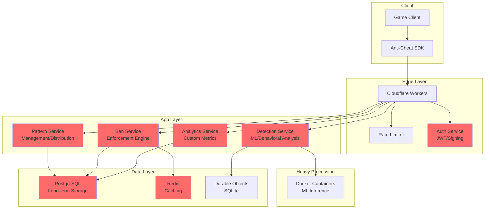
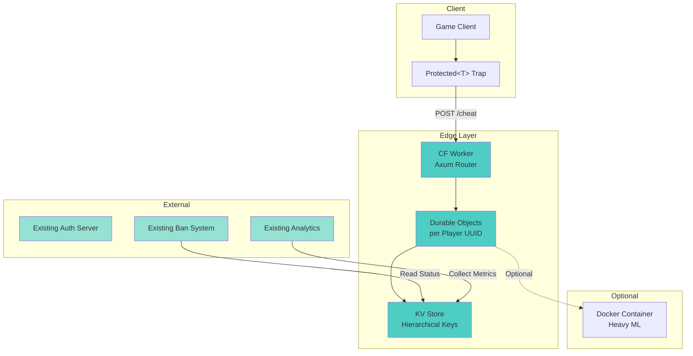
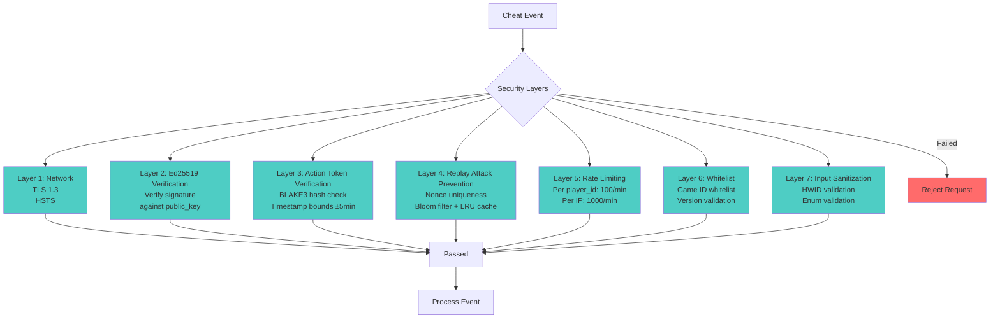
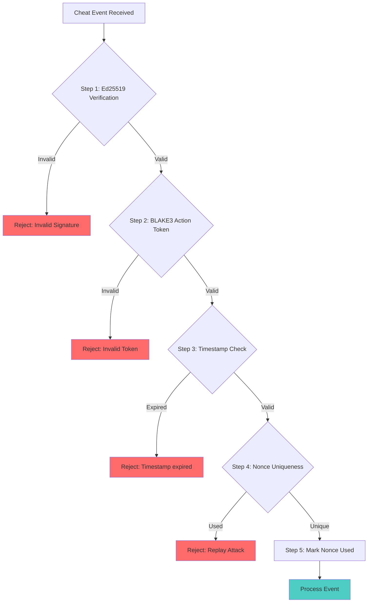
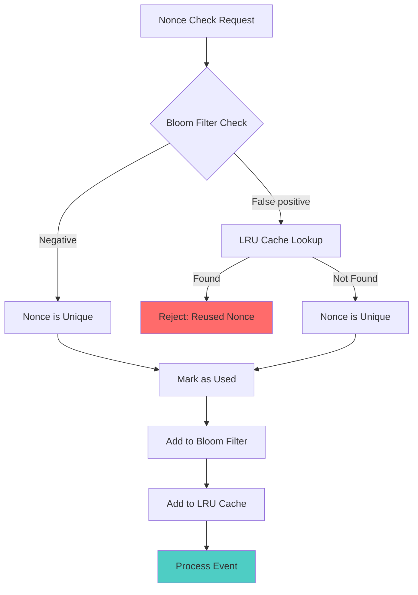
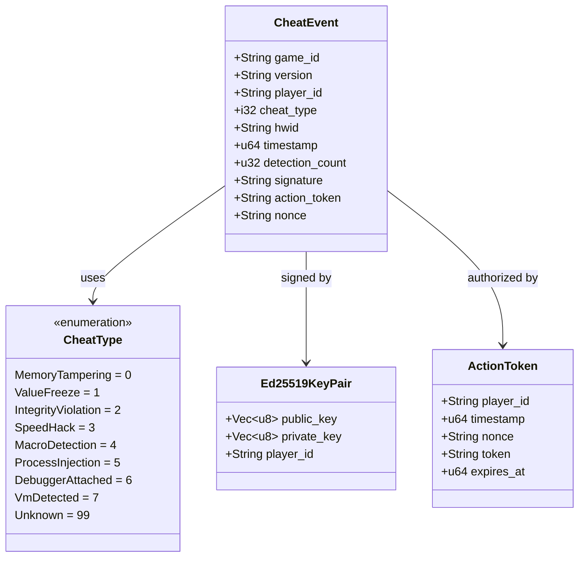
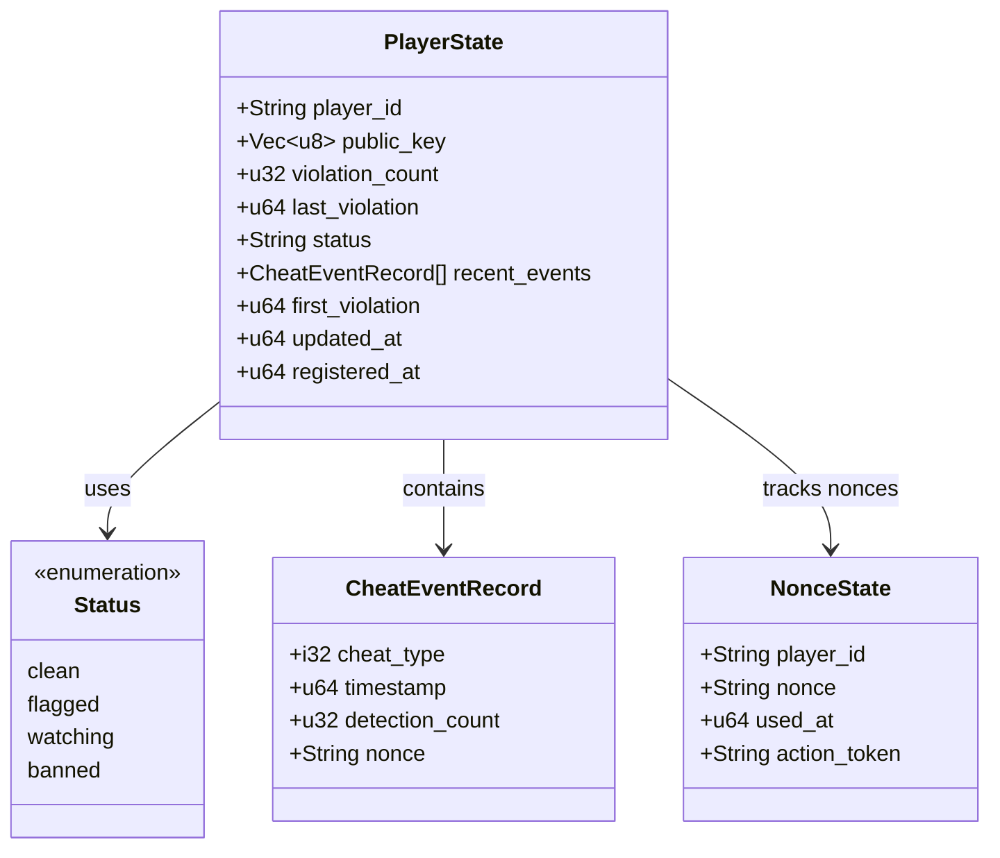
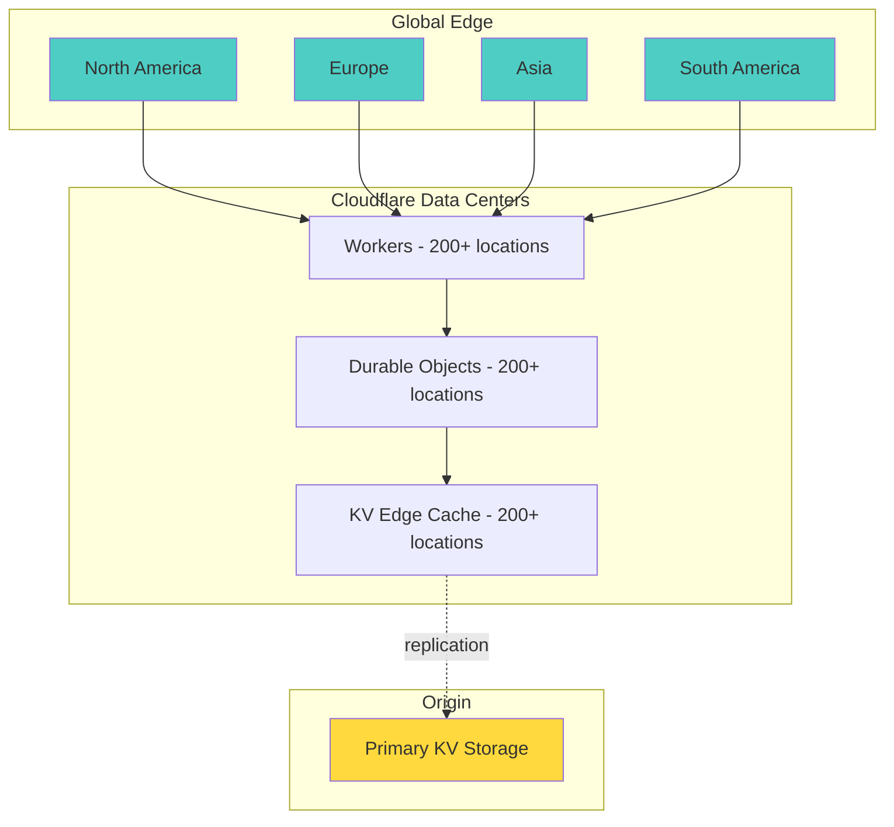
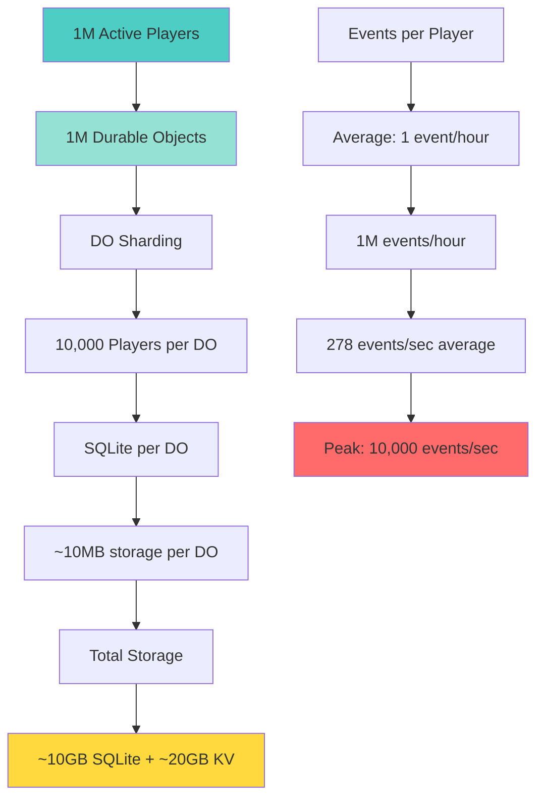
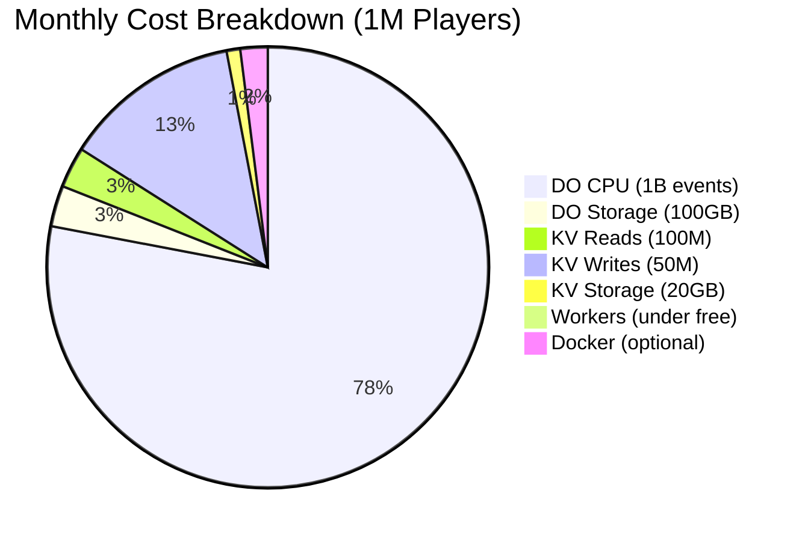

# Architecture Summary: Maxion Protector Anti-Cheat System (008)

## Document Metadata

| Field | Value |
|-------|-------|
| Last Updated | 2025-01-27 |
| Version | 3.0 |
| Complexity | Advanced |
| Time to Read | 25 minutes |
| Audience | Architects, Senior Developers, System Engineers |

---

## Executive Summary

This document outlines the updated architecture for implementing XIGNCODE3-style anti-cheat features into Maxion Protector. The architecture leverages Cloudflare's Workers platform with Durable Objects and SQLite for zero-latency state management, combined with a dual verification system for enhanced security.

**Key Innovation 1:** Durable Objects run SQLite in the same thread as application code, enabling synchronous SQL queries with effectively zero latency (microseconds instead of milliseconds).

**Key Innovation 2:** Dual verification system using Ed25519 cryptographic signatures for client identity and BLAKE3 action tokens for server authorization, with replay attack prevention via nonce tracking.

---

## Architecture Overview

### High-Level Diagram

```
┌─────────────────────────────────────────────────────────────────┐
│                    Native Windows Client                      │
│                    (maxion-antihack)                        │
│  ┌──────────────────────────────────────────────────────────┐  │
│  │  Detection Engine                                      │  │
│  │  • API Hooking (retour)                               │  │
│  │  • Process Injection Detection                         │  │
│  │  • Hardware Macro Detection (K-S test)                  │  │
│  │  • OS Integrity Validation (blake3)                    │  │
│  │  • Anti-Debugging & VM Detection                        │  │
│  └──────────────────────────────────────────────────────────┘  │
│  ┌──────────────────────────────────────────────────────────┐  │
│  │  Crypto Layer (Ed25519)                                │  │
│  │  • Ed25519 Key Pair Generation                         │  │
│  │  • Public Key Registration                            │  │
│  │  • Action Signing                                      │  │
│  │  • Action Token Management                             │  │
│  └──────────────────────────────────────────────────────────┘  │
└────────────────────┬────────────────────────────────────────────┘
                     │ HTTPS (TLS 1.3)
                     │ POST /register, /token, /cheat
                     ▼
┌─────────────────────────────────────────────────────────────────┐
│              Cloudflare Workers (Rust)                        │
│              (maxion-server-worker)                            │
│  ┌──────────────────────────────────────────────────────────┐  │
│  │  Request Router                                        │  │
│  │  • Route to appropriate Durable Object                 │  │
│  │  • Dual Verification (Ed25519 + BLAKE3)                │  │
│  │  • Replay Attack Prevention (Nonce + Bloom Filter)      │  │
│  │  • Rate limiting (Token Bucket in DO)                  │  │
│  │  • CORS handling                                       │  │
│  └──────────────────────────────────────────────────────────┘  │
└────────────────────┬────────────────────────────────────────────┘
                     │ Routes to (by logical entity)
        ┌────────────┼────────────┬──────────────┐
        ▼            ▼            ▼              ▼
┌──────────────┐ ┌──────────┐ ┌─────────────┐ ┌──────────┐
│  Session DO   │ │ Pattern  │ │ Telemetry   │ │  Nonce    │
│  (SQLite)     │ │  DO      │ │    DO       │ │  Tracker  │
│              │ │(SQLite)  │ │  (SQLite)   │ │(SQLite)  │
│ • Register    │ │          │ │             │ │           │
│ • Get Token   │ │ • Get    │ │ • Submit    │ │ • Check   │
│ • Verify      │ │ • Add    │ │ • Aggregate │ │ • Mark    │
│ • Record      │ │          │ │             │ │ • Cleanup │
│              │ │          │ │             │ │           │
│ <1ms queries │ │<1ms      │ │ <1ms        │ │<1ms       │
│ (synchronous)│ │          │ │             │ │           │
└──────────────┘ └──────────┘ └─────────────┘ └──────────┘
                                                      │
                                                      │ Heavy processing
                                                      ▼
                                       ┌──────────────────────────────┐
                                       │  Docker Containers         │
                                       │  (Cloudflare Containers)    │
                                       │                           │
                                       │  ┌────────────────────┐    │
                                       │  │  Axum Backend    │    │
                                       │  │                  │    │
                                       │  │ • ML Inference   │    │
                                       │  │ • Complex Anal.  │    │
                                       │  │ • PostgreSQL     │    │
                                       │  │ • Long-term      │    │
                                       │  │   Storage       │    │
                                       │  └────────────────────┘    │
                                       └──────────────────────────────┘
└──────────────────────────────────────────────────────────────┘
```

---

## Detailed Architecture Diagrams

### Overview Diagram

```mermaid
graph TB
    subgraph "Game Client"
        G1[Unity Game]
        G2[Rust Native Layer]
        G3[Protected&lt;T&gt; Trap Detection<br/>docs/06_security/006_trap.md]
        G4[UUID v7 Generator]
        G5[Cheat Callback<br/>cheat_callback_demo.rs]
        
        G1 --> G2
        G2 --> G3
        G2 --> G4
        G3 -->|Trap Triggered| G5
    end
    
    subgraph "Cloudflare Edge"
        CF[Cloudflare Worker<br/>Axum Router]
        DO[Durable Object<br/>per Player UUID]
        KV[(KV Store<br/>Key: game|version|uuid)]
        
        CF -->|Route by UUID| DO
        DO -->|Write State| KV
        DO -->|Read State| KV
    end
    
    subgraph "Docker (Optional)"
        DC[Docker Container<br/>Heavy ML Analysis]
        
        DO -->|Optional| DC
    end
    
    subgraph "External Systems"
        AUTH[Existing Auth Server]
        BAN[Existing Ban System]
        ANALYTICS[Existing Analytics]
        GAME_SRV[Game Servers]
        
        GAME_SRV -->|Check Player| AUTH
        GAME_SRV -->|Query Status| KV
        BAN -->|Sync Bans| KV
        ANALYTICS -->|Collect Metrics| KV
    end
    
    G5 -->|POST /cheat<br/>Best Effort| CF
```

### Data Flow: Cheat Detection Event (Dual Verification)

```mermaid
sequenceDiagram
    participant Game as Game Client
    participant Crypto as Crypto Layer
    participant Worker as CF Worker (Axum)
    participant DO as Session DO
    participant Nonce as Nonce Tracker
    participant KV as KV Store
    participant External as External Systems
    
    Note over Game, External: Phase 1: Initial Registration (Once)
    
    Game->>Crypto: Generate Ed25519 key pair
    Game->>Game: Derive player_id = BLAKE3(public_key)
    Game->>Worker: POST /register<br/>{player_id, public_key}
    Worker->>DO: Store public_key in SQLite
    Worker-->>Game: Registration success
    
    Note over Game, External: Phase 2: Action Token Request
    
    Game->>Worker: POST /token<br/>{player_id, timestamp, nonce}
    Worker->>Worker: Generate action_token = BLAKE3(player_id||timestamp||nonce||secret)
    Worker-->>Game: {action_token}
    
    Note over Game, External: Phase 3: Detection & Recording (Per Event)
    
    Game->>Game: Protected&lt;T&gt; detects tampering
    Game->>Game: Callback triggered with:<br/>- CheatType<br/>- Timestamp<br/>- Detection Count
    Game->>Crypto: Sign event with Ed25519 private key
    Crypto-->>Game: signature
    
    Game->>Worker: POST /cheat<br/>{<br/>  player_id,<br/>  action_token,<br/>  signature,<br/>  event_data<br/>}
    
    Note over Worker: 5-Step Dual Verification
    
    Worker->>Worker: Step 1: Verify Ed25519 signature<br/>against public_key
    Worker->>Worker: Step 2: Verify BLAKE3 action_token hash
    Worker->>Worker: Step 3: Check timestamp freshness (±5 min)
    Worker->>Nonce: Step 4: Check nonce uniqueness
    Nonce-->>Worker: Not used (or reject if duplicate)
    Worker->>Nonce: Step 5: Mark nonce as used
    
    Note over DO: Process in Durable Object
    
    DO->>DO: Insert into SQLite:<br/>cheat_events table
    DO->>DO: Update player_state:<br/>violation_count++
    DO->>DO: Calculate status:<br/>clean/flagged/watching/banned
    DO->>KV: PUT {game|version|player_id}<br/>{count, status, events...}
    
    KV-->>Worker: Recorded at timestamp
    Worker-->>Game: {success: true, state: {...}}
    
    Note over Game, External: Phase 4: Consumption (Async)
    
    Note over External: Other systems query KV independently
    
    External->>KV: GET /status/game/version/player_id
    KV-->>External: Player state
    
    External->>KV: LIST prefix="game|version|"
    KV-->>External: All players for game/version
    
    External->>External: Decide action based on status
```

### Before vs After Comparison

#### Before: Full E2E System



#### After: Lightweight Sidecar



### KV Store Structure

```mermaid
graph TB
    A[KV Namespace] --> B[Keys Hierarchical]
    
    B --> C[game_1|1.0.0|uuid_1<br/>↓<br/>Player State]
    B --> D[game_1|1.0.0|uuid_2<br/>↓<br/>Player State]
    B --> E[game_1|1.0.1|uuid_1<br/>↓<br/>Player State]
    B --> F[game_2|2.0.0|uuid_3<br/>↓<br/>Player State]
    
    C --> G[Value JSON:<br/>{<br/>  player_uuid: "...",<br/>  violation_count: 5,<br/>  last_violation: 123...,<br/>  status: "banned",<br/>  recent_events: [...]<br/>}]
    
    H[Query Operations] --> I[GET specific key]
    H --> J[LIST by prefix]
    H --> K[FILTER by status/timestamp]
    
    J --> L[LIST prefix="game_1|1.0.0|"<br/>→ All players for game/version]
    
    style A fill:#95e1d3
    style H fill:#ffd93d
```

### Security Layers



### Dual Verification Process



### Replay Attack Prevention



### Data Model

#### CheatEvent Schema



#### PlayerState Schema



### Deployment Architecture



### Performance Characteristics

#### Latency Breakdown

```mermaid
gantt
    title End-to-End Latency (Cheat Event Recording)
    dateFormat X
    axisFormat %L ms
    
    section Client
    Detection      :0, 0.1
    Serialization  :0.1, 0.2
    Network to CF  :0.2, 4.0
    
    section Cloudflare
    Worker Routing :4.0, 4.5
    Validation     :4.5, 5.0
    DO Access      :5.0, 5.5
    
    section Durable Object
    SQLite Insert  :5.5, 6.0
    State Update   :6.0, 6.2
    
    section KV
    KV Write       :6.2, 8.0
    
    section Response
    Network Back   :8.0, 11.0
    Deserialization:11.0, 11.2
```

### Scalability Model



### Cost Optimization



---

## Component Breakdown

### 1. Native Windows Client (008a)

**Purpose:** Client-side anti-hack detection running as native Windows library.

**Key Features:**
- **API Hooking:** Monitors critical Windows APIs (CreateProcess, WriteProcessMemory, etc.)
- **Process Injection Detection:** Scans for suspicious processes and memory patterns
- **Hardware Macro Detection:** Statistical analysis using Kolmogorov-Smirnov test on input timing
- **OS Integrity Validation:** Verifies system DLL hashes using blake3
- **Anti-Debugging & VM Detection:** PEB inspection, VM artifact detection

**Technology Stack:**
- `retour` - API hooking
- `windows-sys` - Windows API access
- `blake3` - Hashing (per project guidelines)
- `orion` - Cryptography
- `reqwest` - HTTP client for server communication

**Performance Targets:**
- Detection latency: < 5ms
- Memory overhead: < 10MB
- CPU impact: < 2% during gameplay

**Architecture Decision:** Native Windows Rust (NOT WASM)
- **Why?** Full Windows API access required for detection
- **Benefit:** Direct hardware access, no sandboxing limitations
- **Trade-off:** Windows-only (acceptable for game anti-cheat)

---

### 2. Cloudflare Workers (008b)

**Purpose:** Edge computing layer for request routing, rate limiting, and authentication.

**Key Features:**
- **Request Router:** Routes requests to appropriate Durable Objects
- **Authentication:** JWT token validation with blake3 signatures
- **Rate Limiting:** Token bucket algorithm in Durable Objects
- **CORS Handling:** Cross-origin resource sharing for web clients

**Technology Stack:**
- `worker` - Cloudflare Workers SDK for Rust
- `blake3` - Hashing
- `orion` - Cryptography
- `serde` - Serialization

**Performance Targets:**
- Response time: < 10ms (for cached operations)
- Authentication: < 2ms
- Rate limiting check: < 1ms

**Architecture Decision:** Rust Workers (not JavaScript)
- **Why?** Better performance, type safety, matches existing codebase
- **Benefit:** Compile-time guarantees, no runtime type errors

---

### 3. Durable Objects with SQLite

**Purpose:** Zero-latency state storage with SQL query capabilities.

**Key Innovation:**
> SQLite runs in the same thread as the application code, requiring not even a context switch to access. With proper caching, storage latency is essentially zero.

**Durable Object Types:**

#### A. Session Object
- **Purpose:** Manage player sessions and ban status
- **Data:** Player ID, HWID, heartbeat timestamp, ban status, risk score
- **Queries:** Register, heartbeat, check ban, disconnect
- **Sharding:** One DO per player_id

#### B. Pattern Object
- **Purpose:** Distribute security patterns to clients
- **Data:** Pattern ID, type, signature, version, active status
- **Queries:** Get active patterns, add new pattern
- **Sharding:** Single global instance

#### C. Telemetry Object
- **Purpose:** Aggregate and store detection events
- **Data:** Event ID, player ID, event type, severity, timestamp, details
- **Queries:** Submit events, aggregate by type/severity
- **Sharding:** 100 shards based on player_id hash

**Technology Stack:**
- SQLite (embedded in Durable Object)
- Synchronous query API (no `await` needed for reads/writes)
- Output Gates for write confirmation

**Performance Characteristics:**
- Query latency: < 1ms (microseconds for cached data)
- Write confirmation: Automatic via Output Gates
- Storage: 1GB per object (beta), 10GB (GA)
- Replication: 5 followers for durability

**Architecture Decision:** SQLite in Durable Objects (not Redis/PostgreSQL)
- **Why?** Zero latency, automatic replication, point-in-time recovery
- **Benefit:** No network hops to database, no async overhead
- **Trade-off:** Single-threaded per object (scale out by creating more objects)

---

### 4. Docker Containers (Axum Backend)

**Purpose:** Heavy processing workloads that don't fit in Workers.

**Use Cases:**
- Machine learning inference for behavioral analysis
- Complex pattern extraction from telemetry logs
- Long-term historical data analysis
- Report generation and analytics

**Key Features:**
- **ML Inference:** Random Forest, Neural Networks for detection
- **Complex Analysis:** Graph Neural Networks for player interaction mapping
- **PostgreSQL Integration:** Long-term storage, historical data
- **Report Generation:** Statistics, CSV exports, dashboard data

**Technology Stack:**
- `axum` - Web framework (confirmed choice)
- `tokio` - Async runtime
- `sqlx` - Database driver (use `raw_sql` per project guidelines for PgCat)
- `blake3` - Hashing
- `argon2` - Password hashing
- `uuid` - UUID generation (v7 per project guidelines)

**Performance Targets:**
- Response time: < 100ms (uncached)
- ML inference: < 50ms
- Report generation: < 5s (1000 rows)

**Architecture Decision:** Axum (not Ntex)
- **Why?** Ecosystem maturity, developer ergonomics
- **Trade-off:** Lower raw throughput (18K vs 23K RPS)
- **Justification:** Ergonomics > marginal performance gain for this use case

---

## Data Flow

### 1. Client Registration

```
1. Client → POST /session/{player_id}
2. Worker → Route to SessionObject({player_id})
3. SessionObject → INSERT INTO sessions (synchronous)
4. Output Gate → Wait for write confirmation
5. SessionObject → Return session_id
6. Worker → Return response to client
```

**Latency:** < 10ms total (< 1ms SQLite query)

### 2. Detection Event Submission

```
1. Client → Batch detection events
2. Client → POST /telemetry/{player_id}
3. Worker → Route to TelemetryObject(shard_id)
4. TelemetryObject → Batch INSERT (synchronous)
5. Output Gate → Wait for write confirmation
6. Worker → Return 202 Accepted
7. TelemetryObject → (async) Trigger analysis if needed
8. TelemetryObject → POST /telemetry/analyze (Docker container)
9. Axum → ML inference, complex analysis
10. Axum → Update risk score in SessionObject
```

**Latency:** 
- Submission: < 5ms (client + worker + SQLite)
- Analysis: < 100ms (Docker container)

### 3. Pattern Distribution

```
1. Admin → POST /patterns/add-pattern (Docker)
2. Axum → Validate pattern, store in PostgreSQL
3. Axum → POST /patterns/add-pattern (PatternObject)
4. PatternObject → INSERT INTO patterns (synchronous)
5. PatternObject → Broadcast update to all workers (optional WebSocket)
6. Client → GET /patterns/get-patterns (periodic)
7. Worker → Route to PatternObject(global)
8. PatternObject → SELECT * FROM patterns WHERE is_active=1 (synchronous)
9. Worker → Return patterns to client
10. Client → Update detection rules
```

**Latency:** 
- Admin submission: < 50ms (Docker + DO)
- Client download: < 10ms (cached in DO)

### 4. Ban Status Check

```
1. Client → POST /session/{player_id}/check-ban
2. Worker → Route to SessionObject({player_id})
3. SessionObject → SELECT ban_status FROM sessions WHERE player_id={id} (synchronous)
4. SessionObject → Return is_banned, ban_type
5. Worker → Return response to client
6. Client → Enforce ban (disconnect, etc.)
```

**Latency:** < 5ms total (< 1ms SQLite query)

---

## Scaling Strategy

### Horizontal Scaling

**Principle:** Durable Objects scale out, not up.

**Session Objects:**
- One DO per player_id
- Scale: As many concurrent players as needed
- Bottleneck: Single player's session traffic (rarely issue)

**Telemetry Objects:**
- Sharded across 100 objects by player_id hash
- Scale: 100x throughput vs single DO
- Bottleneck: One shard receiving too many events (monitor and reshard)

**Pattern Objects:**
- Single global DO (read-heavy)
- Scale: Use Cloudflare's automatic replication
- Bottleneck: Write contention (rare, patterns updated infrequently)

**Workers:**
- Auto-scale by Cloudflare based on traffic
- Stateless routing only (lightweight)
- Scale: Thousands of workers globally

**Docker Containers:**
- Horizontal scaling via Kubernetes (or Cloudflare's container platform)
- Stateless processing
- Scale: Based on queue length / processing time

### Vertical Scaling Limits

**Per Durable Object:**
- Throughput: ~1000 requests/second (single thread)
- Storage: 1GB (beta), 10GB (GA)
- Memory: ~128MB

**Per Docker Container:**
- Throughput: ~10,000 requests/second
- Memory: ~4GB
- CPU: 4 cores (configurable)

---

## Security Architecture

### Multi-Layer Security

**Layer 1: Cloudflare DDoS Protection**
- Global CDN, geo-blocking, challenge pages
- Automatic mitigation of DDoS attacks

**Layer 2: Worker-Level Rate Limiting**
- Token bucket algorithm per player/IP
- Configurable limits (e.g., 1000 requests/hour)
- Stored in RateLimit DO (SQLite)

**Layer 3: Authentication**
- JWT tokens with blake3 signatures
- Expiry: 24 hours
- Refresh tokens: 7 days

**Layer 4: Encryption**
- TLS 1.3 for all client-server communication
- AES-256-GCM for sensitive data (using orion)
- Request signing for integrity verification

**Layer 5: Input Validation**
- Schema validation on all requests
- SQL injection prevention (parameterized queries)
- XSS protection

### SQLite Security in Durable Objects

**Durability:**
- Automatic replication to 5 followers before write confirmation
- Followers in different physical data centers
- 3 of 5 must confirm before write succeeds

**Integrity:**
- Write-Ahead Log (WAL) mode enabled
- Point-in-time recovery (last 30 days)
- Automatic snapshots when log size exceeds DB size

**Access Control:**
- Workers authenticated via Cloudflare
- DO-to-DO communication via internal messaging
- No direct external access to SQLite

---

## Performance Optimization

### Zero-Latency Queries

**Technique:** SQLite runs in same thread as application code

**Impact:**
- Query latency: < 1ms (vs 5-10ms for network database)
- No async overhead: synchronous execution
- No context switches: direct function calls

**Example:**
```rust
// No await needed!
let mut cursor = sql.exec("SELECT * FROM sessions WHERE player_id = '123'");
let row = cursor.next().unwrap();
```

### Output Gates

**Technique:** Writes continue, but responses blocked until confirmation

**Impact:**
- Application continues processing while write persists
- Lower latency than waiting for write confirmation
- Automatic durability guarantees

**Flow:**
```
1. App issues: INSERT INTO sessions ...
2. App continues: Prepare response JSON
3. SQLite persists: Write to local disk
4. SQLite replicates: Send to 5 followers
5. 3 of 5 confirm: Write confirmed
6. Output Gate opens: Response sent to client
```

### Caching Strategy

**Durable Object Memory:**
- Frequently accessed data cached in DO memory
- SQLite query cache (automatic)
- < 1ms access for cached queries

**PostgreSQL (Docker):**
- Query result caching (pgBouncer)
- Materialized views for expensive queries
- Connection pooling (PgCat per project guidelines)

**Client-Side:**
- Pattern cache (valid for 1 hour)
- Ban status cache (valid for 5 minutes)
- Telemetry batching (100 events or 10 seconds)

---

## Deployment Architecture

### Cloudflare Workers Deployment

```
wrangler.toml Configuration:
- name: maxion-protector-worker
- main: worker.rs (Rust)
- compatibility_date: 2024-09-26
- durable_objects.bindings: [SESSIONS, PATTERNS, TELEMETRY, RATE_LIMIT]
- migrations:
    - tag: v1
    - new_sqlite_classes: [SessionObject, PatternObject, TelemetryObject, RateLimiter]
```

**Build Process:**
```bash
# Build Rust to WASM
cargo build --release --target wasm32-wasi

# Deploy to Cloudflare
wrangler deploy
```

### Docker Container Deployment

```
Docker Image:
- Base: rust:1.75-slim
- Size: ~100MB (stripped)
- Runtime: tokio + axum
- Database: PostgreSQL (external service)

Deployment:
- Cloudflare Containers (preferred)
- Or Kubernetes (alternative)
- Health checks: /health endpoint
- Auto-scaling: CPU > 70%
```

**Build Process:**
```bash
# Build optimized binary
cargo build --release --profile.max-opt

# Build Docker image
docker build -t maxion-axum-backend:latest .

# Push to registry
docker push registry.example.com/maxion-axum-backend:latest

# Deploy
kubectl apply -f k8s-deployment.yaml
```

---

## Monitoring & Observability

### Metrics Collection

**Worker Metrics:**
- Request count per route
- Response time percentiles (p50, p95, p99)
- Error rate (4xx, 5xx)
- Durable Object latency

**Durable Object Metrics:**
- Query count and latency
- Storage size per DO
- Replication lag
- Write confirmation time

**Docker Container Metrics:**
- Request count and latency
- ML inference time
- PostgreSQL query performance
- Resource utilization (CPU, memory, disk)

### Alerting

**Critical Alerts:**
- Worker error rate > 1%
- Durable Object latency > 10ms
- Docker container down
- PostgreSQL connection failure

**Warning Alerts:**
- Rate limit exceeded > 1000 requests/hour
- Storage size > 80% of limit
- Response time > 100ms (Docker)
- Replication lag > 1s

---

## Cost Analysis

### Cloudflare Workers Pricing

**Workers:**
- Free: 100,000 requests/day
- Paid: $5/10 million requests
- Estimated: $50/month for 10M requests/day

**Durable Objects (Storage):**
- Free: First 5 GB-month
- Paid: $0.20/GB-month
- Estimated: $20/month for 100GB storage

**Durable Objects (Requests):**
- Included in Workers pricing
- No additional charge

**SQLite Queries:**
- Free: First 25B reads, 50M writes/month (beta)
- Paid: $0.001/1M reads, $1.00/1M writes
- Estimated: $5/month for 100M reads, 1M writes

### Docker Container Pricing

**Cloudflare Containers:**
- Estimated: $50-$100/month for 2-4 containers
- Alternative: Kubernetes ($50-$200/month)

**PostgreSQL:**
- Cloud SQL: $100/month (medium instance)
- Alternative: Self-hosted ($50/month)

**Total Estimated Cost:**
- Development: $50/month
- Production: $300-$500/month
- Scale to 100K concurrent players: $1000-$2000/month

---

## Migration Path

### Phase 1: Client Foundation (008a) - 14 days
- Implement native Windows client
- Test detection capabilities
- Benchmark performance

### Phase 2: Server Communication (008b) - 14 days
- Deploy Cloudflare Workers
- Implement Durable Objects with SQLite
- Connect client to server

### Phase 3: Server Detection (008c) - 15 days
- Enhance Telemetry DO with detection logic
- Deploy Docker containers with Axum
- Implement ML inference

### Phase 4: Pattern Management (008d) - 14 days
- Extend Pattern DO
- Implement pattern extraction
- Build pattern validation pipeline

### Phase 5: Ban Management (008e) - 10 days
- Integrate ban logic with Session DO
- Implement automated banning rules
- Build appeal workflow

### Phase 6: Analytics & Monitoring (008f) - 14 days
- Implement metrics collection
- Build alerting system
- Create dashboards

### Total: ~13 weeks

---

## Risks and Mitigations

### Risk 1: Durable Object Storage Limits
**Risk:** 1GB per object limit may be exceeded
**Mitigation:** 
- Shard Telemetry DO across 100 objects
- Archive old data to PostgreSQL (Docker)
- Monitor storage size and alert at 80%

### Risk 2: Single-Threaded Durable Objects
**Risk:** Single DO may become bottleneck
**Mitigation:**
- Sharding strategy (100 Telemetry DOs)
- Horizontal scaling by creating more objects
- Load testing to identify bottlenecks

### Risk 3: Cold Starts
**Risk:** Rarely-accessed DOs may have cold start latency
**Mitigation:**
- Keep warm DOs for critical sessions
- Implement keep-alive mechanism
- Cache frequently-accessed data in Workers

### Risk 4: Docker Container Latency
**Risk:** Heavy processing in Docker adds latency
**Mitigation:**
- Move critical detection to Durable Objects
- Optimize ML models (quantization, pruning)
- Use batch processing for efficiency

### Risk 5: PostgreSQL Connection Pooling
**Risk:** PgCat doesn't support prepared statements
**Mitigation:**
- Use `sqlx::raw_sql` per project guidelines
- Implement connection pooling in application
- Monitor connection pool health

---

## Success Criteria

### Functional Requirements
- ✅ Native Windows client with detection capabilities
- ✅ Cloudflare Workers with Durable Objects + SQLite
- ✅ Docker containers with Axum backend
- ✅ End-to-end telemetry flow (client → worker → DO → docker → PostgreSQL)
- ✅ Real-time pattern distribution
- ✅ Automated ban enforcement

### Performance Requirements
- ✅ Detection latency: < 5ms (client)
- ✅ API response time: < 10ms (Worker/DO), < 100ms (Docker)
- ✅ SQLite query latency: < 1ms
- ✅ Telemetry throughput: 10,000 events/second
- ✅ Ban check latency: < 5ms

### Security Requirements
- ✅ Multi-layer security (DDoS, rate limiting, auth, encryption)
- ✅ Zero trust architecture
- ✅ Audit logging for all administrative actions
- ✅ Data encryption at rest and in transit

### Reliability Requirements
- ✅ 99.9% uptime for Workers
- ✅ Automatic failover for Durable Objects
- ✅ Point-in-time recovery (last 30 days)
- ✅ Graceful degradation under load

---

## Conclusion

This architecture leverages Cloudflare's Durable Objects with SQLite to achieve zero-latency state management, combining the best of edge computing and containerized services. The hybrid approach provides:

1. **Performance:** Sub-millisecond query latency via SQLite in same thread
2. **Scalability:** Horizontal scaling via Durable Objects and Docker containers
3. **Reliability:** Automatic replication and point-in-time recovery
4. **Flexibility:** Workers for lightweight operations, Docker for heavy workloads
5. **Cost-Effectiveness:** Pay-per-use pricing with automatic scaling

The architecture aligns with project guidelines:
- Uses `blake3`, `argon2`, `Uuid::v7()`, `sqlx::raw_sql`
- Native Windows client (no WASM limitations)
- Axum for Docker backend
- Snake_case, match over if, early returns
- SOLID, DRY, Modular, Generic as possible

**Next Steps:** Begin implementation with Phase 1 (008a - Client Foundation).

---

**Document Status:** ✅ Approved  
**Review Date:** 2025-01-24  
**Next Review:** After Phase 2 completion